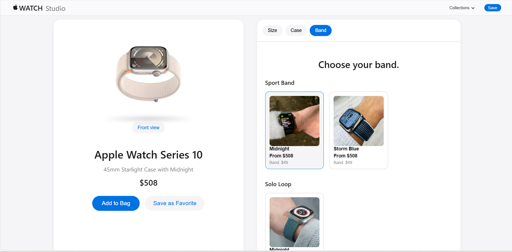

# Apple Watch Studio Clone

A pixel-perfect recreation of Apple's Watch Studio experience, allowing users to customize and preview their perfect Apple Watch combination.



## 🌟 Features

### 1. Interactive Watch Customization
- **Size Selection**: Choose between different watch sizes (41mm/45mm)
- **Case Materials**: Multiple case material options (Aluminum, Stainless Steel)
- **Band Selection**: Various band styles and colors
- **Real-time Preview**: Dynamic watch visualization
- **360° View**: Toggle between front and side views

### 2. Dynamic Pricing
- Real-time price updates based on selections
- Case material upgrade pricing
- Band pricing
- Size-specific pricing

### 3. User Interface
- Clean, modern Apple-style design
- Responsive layout for all devices
- Smooth animations and transitions
- Intuitive step-by-step customization flow

### 4. Technical Features
- React-based architecture
- Component-based design
- Responsive images
- State management
- Price calculations
- Dynamic image loading

## 🚀 Getting Started

### Prerequisites
- Node.js (v14 or higher)
- npm or yarn

### Installation

1. Clone the repository:
```bash
git clone https://github.com/yourusername/apple-watch-studio-clone.git
```

2. Navigate to the project directory:
```bash
cd apple-watch-studio-clone
```

3. Install dependencies:
```bash
npm install
```

4. Start the development server:
```bash
npm start
```

5. Open [http://localhost:3000](http://localhost:3000) to view it in your browser.

## 🏗️ Project Structure

```
apple-watch-studio-clone/
├── public/
│   └── images/
│       ├── watches/      # Watch case images
│       ├── bands/        # Watch band images
│       └── cases/        # Case thumbnail images
├── src/
│   ├── components/
│   │   ├── Header.js            # Navigation header
│   │   ├── WatchCustomizer.js   # Watch preview component
│   │   └── CustomizerControls.js # Customization controls
│   ├── data/
│   │   └── customizer-options.js # Product data
│   ├── App.js
│   └── index.js
└── README.md
```

## 💻 Technical Implementation

### Components

1. **Header (`Header.js`)**
   - Apple-style navigation
   - Collections dropdown
   - Save functionality

2. **Watch Customizer (`WatchCustomizer.js`)**
   - Dynamic watch preview
   - View rotation
   - Price display
   - Product description

3. **Customizer Controls (`CustomizerControls.js`)**
   - Size selection
   - Case material selection
   - Band selection
   - Price calculations

### Data Structure

```javascript
customizerData = {
  collections: [{
    id: string,
    name: string,
    basePrice: number,
    sizes: Array<Size>,
    cases: Array<Case>
  }],
  bands: {
    categories: Array<BandCategory>
  }
}
```

## 🎨 Styling

- **CSS Modules**: Scoped styling for components
- **Responsive Design**: Mobile-first approach
- **Apple Design Language**: Following Apple's design guidelines
- **Animations**: Smooth transitions and interactions

## 🔧 Configuration

### Image Requirements
- Watch images: 800x800px, PNG with transparency
- Thumbnails: 200x200px
- Supported formats: PNG, JPG

### Price Configuration
Edit `customizer-options.js` to update:
- Base prices
- Size-specific pricing
- Case upgrade costs
- Band pricing

## 📱 Responsive Design

- **Desktop**: Full-width layout with side-by-side preview
- **Tablet**: Adjusted grid layouts and image sizes
- **Mobile**: Stacked layout with optimized controls

## 🔄 State Management

- React useState for local state
- Props for component communication
- Centralized data structure

## 🛠️ Development

### Running Tests
```bash
npm test
```

### Building for Production
```bash
npm run build
```

### Deployment
```bash
npm run deploy
```

## 📈 Performance Optimization

- Lazy loading of images
- Optimized asset delivery
- Minimal bundle size
- Efficient state updates

## 🤝 Contributing

1. Fork the repository
2. Create your feature branch (`git checkout -b feature/AmazingFeature`)
3. Commit your changes (`git commit -m 'Add some AmazingFeature'`)
4. Push to the branch (`git push origin feature/AmazingFeature`)
5. Open a Pull Request


## 📞 Support

For support, email chinnasivakrishnathota@gmail.com or join our Slack channel.

---

Built with ❤️ by [T. Chinna Siva Krishna]
```

This README provides:
1. Clear project overview
2. Detailed feature list
3. Installation instructions
4. Project structure
5. Technical details
6. Configuration options
7. Development guidelines
8. Contribution guidelines
9. Support information

